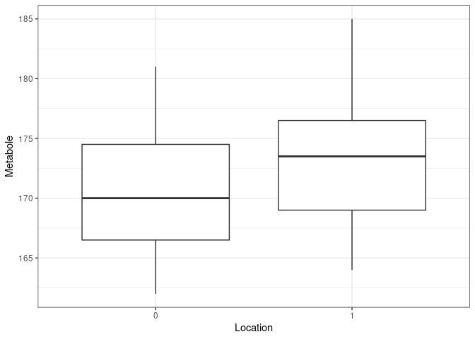
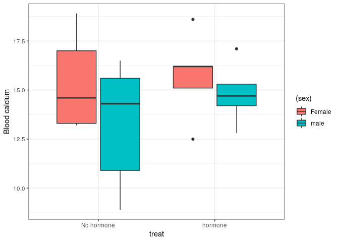
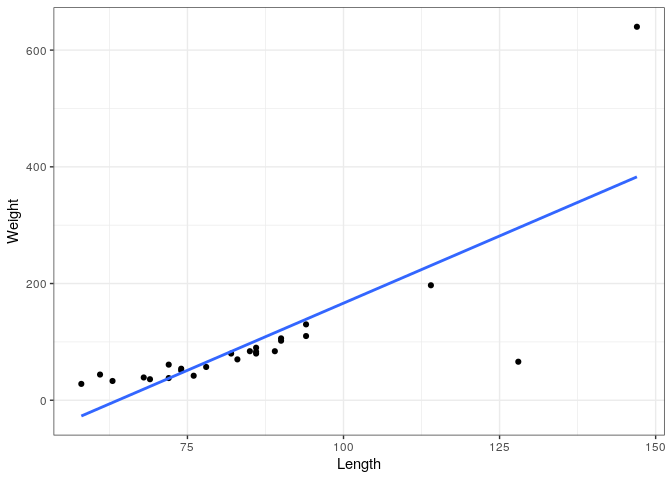
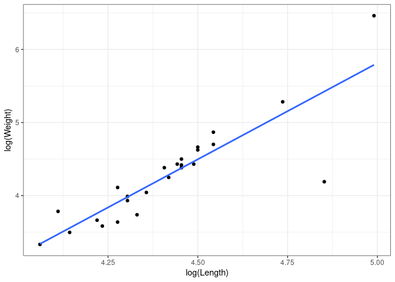

Answers to exercises " Continuous data: Linear models"
================

# Exercise 1

## 1a

``` r
lm1 <- data.frame(metab=c(173,162,176,181,164,169,170,185,
                          164,177,175,172,168),location=
                         c(0,0,0,0,0,0,0,1,1,1,1,1,1))
#
library(ggplot2)
ggplot(lm1,aes(x=factor(location),y=metab))+
  geom_boxplot()+
  labs(x="Location",y="Metabole")+
  theme_bw()
```

<!-- -->

## 1b

``` r
lm2 <- data.frame(blcalc=c(17.0,18.9,13.2,14.6,13.3,16.5,
                        14.3,10.9,15.6,8.9,18.6,16.2,12.5,15.1,
                        16.2,17.1,14.7,15.3,14.2,12.8),
                  treat=gl(2,10,labels=c("No hormone","hormone")),
                  sex=gl(2,5,length=20,labels=c("Female","male")))
metab.fit <- glm(metab~factor(location),data = lm1)
```

## 1c

``` r
drop1(metab.fit,test = "F")
```

    ## Single term deletions
    ## 
    ## Model:
    ## metab ~ factor(location)
    ##                  Df Deviance    AIC F value Pr(>F)
    ## <none>                532.93 91.167               
    ## factor(location)  1   558.00 89.765  0.5175 0.4869

| name     | SS     | df | ms   | F    | p=value |
| -------- | ------ | -- | ---- | ---- | ------- |
| Location | 25.1   | 1  | 25.1 | 0.52 | 0.4869  |
| Residual | 532.93 | 11 | 48.4 |      |         |
| Total    | 558    | 12 |      |      |         |

## 1d

The F-value is 0.52 with a p-value of 0.4869 which is larger then 0.05
so the null-hypothesis is not rejected. This research cannot show that
there is a location effect on the metabole.

# Exercise 2

## 2a

``` r
lm2 <- data.frame(blcalc=c(17.0,18.9,13.2,14.6,13.3,16.5,14.3,
                         10.9,15.6,8.9,18.6,16.2,12.5,15.1,16.2,17.1,14.7,15.3,14.2,12.8),
                  treat=gl(2,10,labels=c("No hormone","hormone")),
                  sex=gl(2,5,length=20,labels=c("Female","male")))
```

The function gl() makes a factor varable and it works as follows: gl(n,
k, length = n\*k, labels = 1:n, ordered = FALSE) n=an integer giving the
number of levels. k=an integer giving the number of replications.
length=an integer giving the length of the result. labels an optional
vector of labels for the resulting factor levels. ordered a logical
indicating whether the result should be ordered or not.

``` r
ggplot(lm2,aes(y=blcalc,x=treat,fill=sex))+
  geom_boxplot()+
  labs(y="Blood calcium")+
  theme_bw()
```

<!-- -->

## 2b

``` r
blcalc.fit <- glm(blcalc~treat+sex,data = lm2)
```

## 2c

``` r
drop1(blcalc.fit,test="F")
```

    ## Single term deletions
    ## 
    ## Model:
    ## blcalc ~ treat + sex
    ##        Df Deviance    AIC F value Pr(>F)
    ## <none>      97.733 96.488               
    ## treat   1  102.245 95.390  0.7849 0.3880
    ## sex     1  109.437 96.750  2.0359 0.1717

SS for treat 102.245-97.733=4.512 and for sex 109.437-97.733=11.704

| name     | SS     | df | ms    | F    | p=value |
| -------- | ------ | -- | ----- | ---- | ------- |
| treat    | 4.51   | 1  | 4.51  | 0.79 | 0.3880  |
| sex      | 11.70  | 1  | 11.70 | 2.04 | 0.1717  |
| residual | 97.73  | 17 | 5.75  |      |         |
| total    | 113.95 |    |       |      |         |

## 2d

For sex p-value= 0.17 so one can not show diffrenece between males and
females. For treat the p-value=0.3880 so one can not show diffrenece
between the hormone groups.

## 2e

``` r
summary(blcalc.fit)
```

    ## 
    ## Call:
    ## glm(formula = blcalc ~ treat + sex, data = lm2)
    ## 
    ## Deviance Residuals: 
    ##    Min      1Q  Median      3Q     Max  
    ## -4.655  -1.725   0.165   1.948   3.815  
    ## 
    ## Coefficients:
    ##              Estimate Std. Error t value Pr(>|t|)    
    ## (Intercept)   15.0850     0.9286  16.244 8.69e-12 ***
    ## treathormone   0.9500     1.0723   0.886    0.388    
    ## sexmale       -1.5300     1.0723  -1.427    0.172    
    ## ---
    ## Signif. codes:  0 '***' 0.001 '**' 0.01 '*' 0.05 '.' 0.1 ' ' 1
    ## 
    ## (Dispersion parameter for gaussian family taken to be 5.748971)
    ## 
    ##     Null deviance: 113.950  on 19  degrees of freedom
    ## Residual deviance:  97.733  on 17  degrees of freedom
    ## AIC: 96.488
    ## 
    ## Number of Fisher Scoring iterations: 2

In the summary the line factor(hormone)2 gives the difference between
the mean blood calcium of the hormone group and the the mean blood
calcium of the no hormone group. This difference is .95 with a standard
error of 1.0723

# exercise 3

## 3a

``` r
lm3 <- read.table("aligator.txt",header=TRUE)
```

or with read in the data with the rstudio menu: import dataset, from
text.

``` r
ggplot(lm3,aes(y=Weight,x=Length))+
  geom_point()+
  geom_smooth(method = lm,se=FALSE)+
  theme_bw()
```

<!-- -->

## 3b

``` r
ggplot(lm3,aes(y=log(Weight),x=log(Length)))+
  geom_point()+
  geom_smooth(method = lm,se=FALSE)+
  theme_bw()
```

<!-- --> \#\#
3c

``` r
cor(lm3$Length,lm3$Weight)
```

    ## [1] 0.7539555

``` r
cor(log(lm3$Length),log(lm3$Weight))
```

    ## [1] 0.8022409

The log version is a better.

## 3d

``` r
Wght.fit <- glm(log(Weight)~log(Length),data = lm3)
summary(Wght.fit)
```

    ## 
    ## Call:
    ## glm(formula = log(Weight) ~ log(Length), data = lm3)
    ## 
    ## Deviance Residuals: 
    ##      Min        1Q    Median        3Q       Max  
    ## -1.14760  -0.11467   0.01308   0.14533   0.86451  
    ## 
    ## Coefficients:
    ##             Estimate Std. Error t value Pr(>|t|)    
    ## (Intercept)  -6.4768     1.6704  -3.877 0.000762 ***
    ## log(Length)   2.4349     0.3778   6.445 1.41e-06 ***
    ## ---
    ## Signif. codes:  0 '***' 0.001 '**' 0.01 '*' 0.05 '.' 0.1 ' ' 1
    ## 
    ## (Dispersion parameter for gaussian family taken to be 0.1598641)
    ## 
    ##     Null deviance: 10.3164  on 24  degrees of freedom
    ## Residual deviance:  3.6769  on 23  degrees of freedom
    ## AIC: 29.027
    ## 
    ## Number of Fisher Scoring iterations: 2

Weight=-6.48+2.435\*Length+residual

## 3e

``` r
drop1(Wght.fit,test="F")
```

    ## Single term deletions
    ## 
    ## Model:
    ## log(Weight) ~ log(Length)
    ##             Df Deviance    AIC F value    Pr(>F)    
    ## <none>           3.6769 29.027                      
    ## log(Length)  1  10.3164 52.818  41.532 1.413e-06 ***
    ## ---
    ## Signif. codes:  0 '***' 0.001 '**' 0.01 '*' 0.05 '.' 0.1 ' ' 1

| name     | SS    | df | ms   | F    | p=value    |
| -------- | ----- | -- | ---- | ---- | ---------- |
| Location | 6.64  | 1  | 6.64 | 41.5 | 1.4\*10^-6 |
| Residual | 3.68  | 23 | 0.16 |      |            |
| Total    | 10.32 | 24 |      |      |            |

The nulhypothesis that the regression coefficient in the population is
zero is rejected since the p value is very low.

# exercise 4

## 4a

``` r
lm4 <- data.frame(bp=c(87,86.5,89,88.5,87.5,88,86.5,87,85,86,85,83),
                dose=c(5,6,7,8,9,10,5,6,7,8,9,10),
                group=c(0,0,0,0,0,0,1,1,1,1,1,1))
lm4$fgroup <- factor(lm4$group)
lm4$prod <- with(lm4,group*dose)
```

## 4b

``` r
model.i <- glm(bp~group+dose+group:dose,data = lm4)
model.ii <- glm(bp~fgroup+dose+fgroup:dose,data = lm4)
model.iii <- glm(bp~group+group:dose,data = lm4)
model.iv <- glm(bp~group+prod,data = lm4)
model.v <- glm(bp~fgroup+fgroup:dose,data = lm4)
```

## 4c+4d

``` r
summary(model.i)
```

    ## 
    ## Call:
    ## glm(formula = bp ~ group + dose + group:dose, data = lm4)
    ## 
    ## Deviance Residuals: 
    ##     Min       1Q   Median       3Q      Max  
    ## -0.9286  -0.6131  -0.2500   0.6250   1.3571  
    ## 
    ## Coefficients:
    ##             Estimate Std. Error t value Pr(>|t|)    
    ## (Intercept)  86.1429     1.6635  51.785 2.14e-11 ***
    ## group         4.0952     2.3525   1.741   0.1199    
    ## dose          0.2143     0.2163   0.991   0.3508    
    ## group:dose   -0.8571     0.3058  -2.803   0.0231 *  
    ## ---
    ## Signif. codes:  0 '***' 0.001 '**' 0.01 '*' 0.05 '.' 0.1 ' ' 1
    ## 
    ## (Dispersion parameter for gaussian family taken to be 0.8184524)
    ## 
    ##     Null deviance: 30.9167  on 11  degrees of freedom
    ## Residual deviance:  6.5476  on  8  degrees of freedom
    ## AIC: 36.785
    ## 
    ## Number of Fisher Scoring iterations: 2

y=86.1429+0.2143dose and y=90.2381-0.6428dose

``` r
summary(model.ii)
```

    ## 
    ## Call:
    ## glm(formula = bp ~ fgroup + dose + fgroup:dose, data = lm4)
    ## 
    ## Deviance Residuals: 
    ##     Min       1Q   Median       3Q      Max  
    ## -0.9286  -0.6131  -0.2500   0.6250   1.3571  
    ## 
    ## Coefficients:
    ##              Estimate Std. Error t value Pr(>|t|)    
    ## (Intercept)   86.1429     1.6635  51.785 2.14e-11 ***
    ## fgroup1        4.0952     2.3525   1.741   0.1199    
    ## dose           0.2143     0.2163   0.991   0.3508    
    ## fgroup1:dose  -0.8571     0.3058  -2.803   0.0231 *  
    ## ---
    ## Signif. codes:  0 '***' 0.001 '**' 0.01 '*' 0.05 '.' 0.1 ' ' 1
    ## 
    ## (Dispersion parameter for gaussian family taken to be 0.8184524)
    ## 
    ##     Null deviance: 30.9167  on 11  degrees of freedom
    ## Residual deviance:  6.5476  on  8  degrees of freedom
    ## AIC: 36.785
    ## 
    ## Number of Fisher Scoring iterations: 2

same as model.i

``` r
summary(model.iii)
```

    ## 
    ## Call:
    ## glm(formula = bp ~ group + group:dose, data = lm4)
    ## 
    ## Deviance Residuals: 
    ##     Min       1Q   Median       3Q      Max  
    ## -1.2500  -0.7411   0.0000   0.6518   1.2500  
    ## 
    ## Coefficients:
    ##             Estimate Std. Error t value Pr(>|t|)    
    ## (Intercept)  87.7500     0.3690 237.829   <2e-16 ***
    ## group         2.4881     1.7023   1.462   0.1779    
    ## group:dose   -0.6429     0.2160  -2.976   0.0156 *  
    ## ---
    ## Signif. codes:  0 '***' 0.001 '**' 0.01 '*' 0.05 '.' 0.1 ' ' 1
    ## 
    ## (Dispersion parameter for gaussian family taken to be 0.8167989)
    ## 
    ##     Null deviance: 30.9167  on 11  degrees of freedom
    ## Residual deviance:  7.3512  on  9  degrees of freedom
    ## AIC: 36.174
    ## 
    ## Number of Fisher Scoring iterations: 2

y=87.75 and y=90.2381 - 0.6429\*dose so no relation with dose in group 0

``` r
summary(model.iv)
```

    ## 
    ## Call:
    ## glm(formula = bp ~ group + prod, data = lm4)
    ## 
    ## Deviance Residuals: 
    ##     Min       1Q   Median       3Q      Max  
    ## -1.2500  -0.7411   0.0000   0.6518   1.2500  
    ## 
    ## Coefficients:
    ##             Estimate Std. Error t value Pr(>|t|)    
    ## (Intercept)  87.7500     0.3690 237.829   <2e-16 ***
    ## group         2.4881     1.7023   1.462   0.1779    
    ## prod         -0.6429     0.2160  -2.976   0.0156 *  
    ## ---
    ## Signif. codes:  0 '***' 0.001 '**' 0.01 '*' 0.05 '.' 0.1 ' ' 1
    ## 
    ## (Dispersion parameter for gaussian family taken to be 0.8167989)
    ## 
    ##     Null deviance: 30.9167  on 11  degrees of freedom
    ## Residual deviance:  7.3512  on  9  degrees of freedom
    ## AIC: 36.174
    ## 
    ## Number of Fisher Scoring iterations: 2

same as model.iii

``` r
summary(model.v)
```

    ## 
    ## Call:
    ## glm(formula = bp ~ fgroup + fgroup:dose, data = lm4)
    ## 
    ## Deviance Residuals: 
    ##     Min       1Q   Median       3Q      Max  
    ## -0.9286  -0.6131  -0.2500   0.6250   1.3571  
    ## 
    ## Coefficients:
    ##              Estimate Std. Error t value Pr(>|t|)    
    ## (Intercept)   86.1429     1.6635  51.785 2.14e-11 ***
    ## fgroup1        4.0952     2.3525   1.741   0.1199    
    ## fgroup0:dose   0.2143     0.2163   0.991   0.3508    
    ## fgroup1:dose  -0.6429     0.2163  -2.973   0.0178 *  
    ## ---
    ## Signif. codes:  0 '***' 0.001 '**' 0.01 '*' 0.05 '.' 0.1 ' ' 1
    ## 
    ## (Dispersion parameter for gaussian family taken to be 0.8184524)
    ## 
    ##     Null deviance: 30.9167  on 11  degrees of freedom
    ## Residual deviance:  6.5476  on  8  degrees of freedom
    ## AIC: 36.785
    ## 
    ## Number of Fisher Scoring iterations: 2

Same as model.i but now with regression coefficients explicit in the
output. This is the nested version of the model.Note that the difference
fgroup1:dose-fgroup0:dose=-.8571 the interaction from model.i and
model.ii. So the interaction term in these models shows wether the
difference inslopes is the same in both groups.

Usually first model i or ii is fitted. Then if the interaction is
important the nested version (model v) can be fitted to see which of the
slopes are important. The slope in group2 is significant so then
model.iii or model.iv can be fitted.

So by choosing a parameterization various aspects of the regression
equations can be made explicit (e.g. the equation for both groups, or
the difference in slope and/or intercept).

# exercise 5

## 5a

``` r
lm5 <- read.table("lowbirth.dat",header=TRUE)
#
fit.0 <- glm(bwt~ht+smoke+age+smoke:ht+age:ht,data = lm5)
drop1(fit.0,test="F")
```

    ## Single term deletions
    ## 
    ## Model:
    ## bwt ~ ht + smoke + age + smoke:ht + age:ht
    ##          Df Deviance    AIC F value   Pr(>F)   
    ## <none>      89847460 3020.9                    
    ## ht:smoke  1 90112593 3019.5  0.5400 0.463366   
    ## ht:age    1 93340890 3026.2  7.1154 0.008328 **
    ## ---
    ## Signif. codes:  0 '***' 0.001 '**' 0.01 '*' 0.05 '.' 0.1 ' ' 1

So the ht:age interaction is needed in the model. Now fit the model
without the ht:smoke interaction: interpretation: for instance ht:age,
the age effect depends on the hypertension group. \#\# 5c

``` r
fit.1 <- glm(bwt~ht+smoke+age+age:ht,data = lm5)
drop1(fit.1,test="F")
```

    ## Single term deletions
    ## 
    ## Model:
    ## bwt ~ ht + smoke + age + age:ht
    ##        Df Deviance    AIC F value   Pr(>F)   
    ## <none>    90112593 3019.5                    
    ## smoke   1 93454969 3024.4  6.8248 0.009733 **
    ## ht:age  1 93655051 3024.8  7.2333 0.007814 **
    ## ---
    ## Signif. codes:  0 '***' 0.001 '**' 0.01 '*' 0.05 '.' 0.1 ' ' 1

So no futher reduction is possible.(Age stays in the model since the
ht:age interaction is in the model.)

``` r
summary(fit.1)
```

    ## 
    ## Call:
    ## glm(formula = bwt ~ ht + smoke + age + age:ht, data = lm5)
    ## 
    ## Deviance Residuals: 
    ##      Min        1Q    Median        3Q       Max  
    ## -2174.16   -438.51     48.85    478.79   1556.97  
    ## 
    ## Coefficients:
    ##             Estimate Std. Error t value Pr(>|t|)    
    ## (Intercept) 2699.463    240.220  11.237  < 2e-16 ***
    ## ht          2568.064   1132.100   2.268  0.02447 *  
    ## smoke       -272.746    104.403  -2.612  0.00973 ** 
    ## age           16.302      9.847   1.655  0.09955 .  
    ## ht:age      -130.504     48.524  -2.689  0.00781 ** 
    ## ---
    ## Signif. codes:  0 '***' 0.001 '**' 0.01 '*' 0.05 '.' 0.1 ' ' 1
    ## 
    ## (Dispersion parameter for gaussian family taken to be 489742.4)
    ## 
    ##     Null deviance: 99917053  on 188  degrees of freedom
    ## Residual deviance: 90112593  on 184  degrees of freedom
    ## AIC: 3019.5
    ## 
    ## Number of Fisher Scoring iterations: 2
