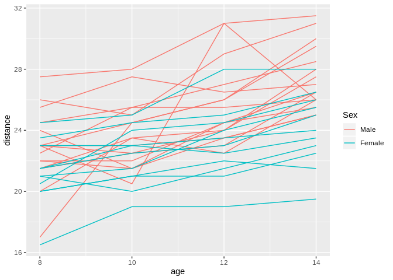
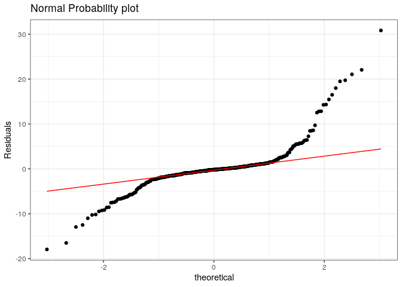

Answers to exercises “Dependent data: Mixed effect models” part 1
================

# Exercise 1

## 1a

``` r
mm1 <- nlme::Milk[nlme::Milk$Time<=3,]
mm1 <- mm1[mm1$Time!=2,]
unpa <- t.test(protein~Time,paired = FALSE, var.equal = TRUE, data = mm1)
unpa
```

    ## 
    ##  Two Sample t-test
    ## 
    ## data:  protein by Time
    ## t = 7.9805, df = 156, p-value = 2.95e-13
    ## alternative hypothesis: true difference in means is not equal to 0
    ## 95 percent confidence interval:
    ##  0.3242353 0.5375368
    ## sample estimates:
    ## mean in group 1 mean in group 3 
    ##        3.834051        3.403165

``` r
unpa$stderr
```

    ## [1] 0.05399252

## 1b

``` r
pa <- t.test(protein~Time, paired=TRUE, data = mm1)
pa
```

    ## 
    ##  Paired t-test
    ## 
    ## data:  protein by Time
    ## t = 10.583, df = 78, p-value < 2.2e-16
    ## alternative hypothesis: true difference in means is not equal to 0
    ## 95 percent confidence interval:
    ##  0.3498302 0.5119419
    ## sample estimates:
    ## mean of the differences 
    ##               0.4308861

``` r
pa$stderr
```

    ## [1] 0.04071425

## 1c

The standard error for the paired case is smaller because the
observations on timepoint 1 and on timepoint 3 are correlated:

``` r
t1 <- mm1$protein[mm1$Time==1]
t3 <- mm1$protein[mm1$Time==3]
cor.test(t1,t3)
```

    ## 
    ##  Pearson's product-moment correlation
    ## 
    ## data:  t1 and t3
    ## t = 4.6777, df = 77, p-value = 1.217e-05
    ## alternative hypothesis: true correlation is not equal to 0
    ## 95 percent confidence interval:
    ##  0.2782437 0.6263725
    ## sample estimates:
    ##       cor 
    ## 0.4704131

So the correlation between protein on time 1 and time 3 is 0.47 with a
95% two sided confidence interval of (0.28;0.63)

## 1d

``` r
library(lme4)
```

    ## Loading required package: Matrix

``` r
fit <- lmer(protein~factor(Time)+(1|Cow),REML=FALSE,data=mm1)
summary(fit)
```

    ## Linear mixed model fit by maximum likelihood  ['lmerMod']
    ## Formula: protein ~ factor(Time) + (1 | Cow)
    ##    Data: mm1
    ## 
    ##      AIC      BIC   logLik deviance df.resid 
    ##     96.6    108.8    -44.3     88.6      154 
    ## 
    ## Scaled residuals: 
    ##      Min       1Q   Median       3Q      Max 
    ## -2.90269 -0.54023  0.03935  0.65442  1.82226 
    ## 
    ## Random effects:
    ##  Groups   Name        Variance Std.Dev.
    ##  Cow      (Intercept) 0.04904  0.2215  
    ##  Residual             0.06465  0.2543  
    ## Number of obs: 158, groups:  Cow, 79
    ## 
    ## Fixed effects:
    ##               Estimate Std. Error t value
    ## (Intercept)    3.83405    0.03794  101.07
    ## factor(Time)3 -0.43089    0.04046  -10.65
    ## 
    ## Correlation of Fixed Effects:
    ##             (Intr)
    ## factor(Tm)3 -0.533

## 1e

With the random intercept model the result:

``` 
           Estimate Std. Error t value  
           ...
```

factor(Time)3 -0.43089 0.04046 -10.56

is the same as with the paired t-test. (The difference in sign is
because the random intercept model catculates the difference in means
beyween time 3 and time 1, whereas the pairde t-test takes this
diffrence between time 3 and time 1)

# Exercise 2

## 2a

``` r
Od <- nlme::Orthodont
library(ggplot2)
library(lme4)
ggplot(Od,aes(x=age,y=distance,group=Subject))+geom_line(aes(color=Sex))
```

<!-- -->

``` r
fit.od <- lmer(distance~factor(age)+factor(Sex)+factor(age):factor(Sex)+(1|Subject), REML=FALSE, data = Od)
```

## 2b

``` r
Od <- data.frame(Od,res=residuals(fit.od))
ggplot(Od,aes(sample=res))+
  stat_qq()+stat_qq_line(color="red")+
  labs(y="Residuals",
       title="Normal Probability plot")+
  theme_bw()
```

<!-- -->

## 2c

``` r
drop1(fit.od)
```

    ## Single term deletions
    ## 
    ## Model:
    ## distance ~ factor(age) + factor(Sex) + factor(age):factor(Sex) + 
    ##     (1 | Subject)
    ##                         Df    AIC
    ## <none>                     446.63
    ## factor(age):factor(Sex)  3 447.94

Interaction can be legt out.

``` r
fit.od2 <- lmer(distance~factor(age)+factor(Sex)+(1|Subject), REML=FALSE, data = Od)
drop1(fit.od2)
```

    ## Single term deletions
    ## 
    ## Model:
    ## distance ~ factor(age) + factor(Sex) + (1 | Subject)
    ##             Df    AIC
    ## <none>         447.94
    ## factor(age)  3 514.96
    ## factor(Sex)  1 454.48

``` r
summary(fit.od2,correlation=FALSE)
```

    ## Linear mixed model fit by maximum likelihood  ['lmerMod']
    ## Formula: distance ~ factor(age) + factor(Sex) + (1 | Subject)
    ##    Data: Od
    ## 
    ##      AIC      BIC   logLik deviance df.resid 
    ##    447.9    466.7   -217.0    433.9      101 
    ## 
    ## Scaled residuals: 
    ##     Min      1Q  Median      3Q     Max 
    ## -3.8981 -0.5328  0.0029  0.4251  3.7267 
    ## 
    ## Random effects:
    ##  Groups   Name        Variance Std.Dev.
    ##  Subject  (Intercept) 2.999    1.732   
    ##  Residual             2.001    1.415   
    ## Number of obs: 108, groups:  Subject, 27
    ## 
    ## Fixed effects:
    ##                   Estimate Std. Error t value
    ## (Intercept)        23.1308     0.5237  44.165
    ## factor(age)10       0.9815     0.3850   2.549
    ## factor(age)12       2.4630     0.3850   6.397
    ## factor(age)14       3.9074     0.3850  10.148
    ## factor(Sex)Female  -2.3210     0.7327  -3.168

``` r
confint(fit.od2)
```

    ## Computing profile confidence intervals ...

    ##                        2.5 %     97.5 %
    ## .sig01             1.2768850  2.4054087
    ## .sigma             1.2219785  1.6640610
    ## (Intercept)       22.0794856 24.1820885
    ## factor(age)10      0.2177747  1.7451883
    ## factor(age)12      1.6992562  3.2266697
    ## factor(age)14      3.1437006  4.6711142
    ## factor(Sex)Female -3.8096583 -0.8323871

# Exercise 3

## 3a

``` r
mm3 <- grouseticks
fit.gr <- lmer(TICKS~HEIGHT+factor(YEAR)+(1|BROOD),REML=FALSE,data = mm3)
```

## 3b

``` r
drop1(fit.gr,test="Chisq")
```

    ## Single term deletions
    ## 
    ## Model:
    ## TICKS ~ HEIGHT + factor(YEAR) + (1 | BROOD)
    ##              Df    AIC    LRT   Pr(Chi)    
    ## <none>          2769.7                     
    ## HEIGHT        1 2782.8 15.147 9.944e-05 ***
    ## factor(YEAR)  2 2780.1 14.404 0.0007449 ***
    ## ---
    ## Signif. codes:  0 '***' 0.001 '**' 0.01 '*' 0.05 '.' 0.1 ' ' 1

## 3c

``` r
mm3 <- data.frame(mm3,res=residuals(fit.gr))
ggplot(mm3,aes(sample=res))+
  stat_qq()+stat_qq_line(color="red")+
  labs(y="Residuals",
       title="Normal Probability plot")+
  theme_bw()
```

<!-- -->

This model does not fit the data well. Since THICKS is a count variable,
a poisson model migth do a better job.
