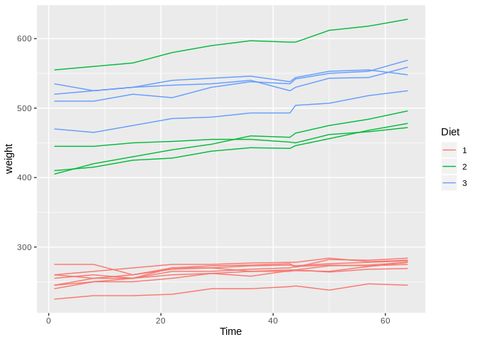
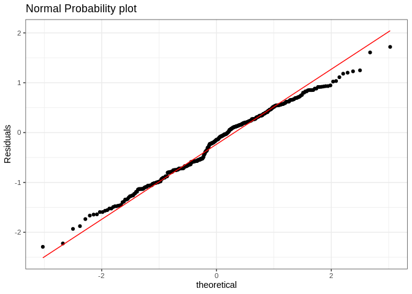

Answers to exercises “Dependent data: Mixed effect models” part 2
================

# Exercise 1

## 1a

``` r
library(lme4)
```

    ## Loading required package: Matrix

``` r
mm2.1 <- nlme::Milk[nlme::Milk$Time<8,]
fit.m1 <- lmer(protein~factor(Time)+factor(Diet)+factor(Diet):factor(Time)+
                   (1+Time|Cow),data = mm2.1)
```

    ## Warning in checkConv(attr(opt, "derivs"), opt$par, ctrl =
    ## control$checkConv, : Model failed to converge with max|grad| = 0.0228757
    ## (tol = 0.002, component 1)

``` r
fit.m2 <- lmer(protein~factor(Time)+factor(Diet)+factor(Diet):factor(Time)+
                   (1|Cow),data = mm2.1)
fit.m3 <- lmer(protein~factor(Time)+factor(Diet)+factor(Diet):factor(Time)+
                   (0+Time|Cow),data = mm2.1)
AIC(fit.m1,fit.m2,fit.m3)
```

    ##        df      AIC
    ## fit.m1 25 149.8302
    ## fit.m2 23 172.1767
    ## fit.m3 23 239.1878

## 1b

``` r
fit.m2 <- lmer(protein~factor(Time)+factor(Diet)+factor(Diet):factor(Time)+
                   (1|Cow),data = mm2.1)
fit.m3 <- lmer(protein~factor(Time)+factor(Diet)+factor(Diet):factor(Time)+
                   (0+Time|Cow),data = mm2.1)
AIC(fit.m1,fit.m2,fit.m3)
```

    ##        df      AIC
    ## fit.m1 25 149.8302
    ## fit.m2 23 172.1767
    ## fit.m3 23 239.1878

So the model with the random intercepts and the random slopes fits the
data best.

## 1c

``` r
fit.m4 <- lmer(protein~factor(Time)+factor(Diet)+factor(Diet):factor(Time)+
                   (1+Time|Cow),REML=FALSE, data = mm2.1)
drop1(fit.m1)
```

    ## Single term deletions
    ## 
    ## Model:
    ## protein ~ factor(Time) + factor(Diet) + factor(Diet):factor(Time) + 
    ##     (1 + Time | Cow)
    ##                           Df    AIC
    ## <none>                       61.123
    ## factor(Time):factor(Diet) 12 53.310

Interaction is not needed in the model.

``` r
fit.m5 <- lmer(protein~factor(Time)+(Diet)+(1+Time|Cow), 
               REML=FALSE,control = lmerControl(optimizer ="Nelder_Mead"), 
               data = mm2.1)
drop1(fit.m5)
```

    ## Single term deletions
    ## 
    ## Model:
    ## protein ~ factor(Time) + (Diet) + (1 + Time | Cow)
    ##              Df    AIC
    ## <none>           53.31
    ## factor(Time)  6 235.79
    ## Diet          2  57.02

## 1d

Now there is a diet effect. (Nelder\_mead is used to avoid convergence
problems)

# Exercise 2

## 2a

``` r
mm2.2 <- nlme::BodyWeight
?nlme::BodyWeight
```

``` r
library(ggplot2)
ggplot(mm2.2,aes(x=Time,y=weight,group=Rat))+geom_line(aes(color=Diet))
```

<!-- -->

## 2b

``` r
fit.r1 <- lmer(weight~factor(Time)+factor(Diet)+factor(Diet):factor(Time)+
                 (1+Time|Rat),control = lmerControl(optimizer ="Nelder_Mead"),
               data = mm2.2)
fit.r2 <- lmer(weight~factor(Time)+factor(Diet)+factor(Diet):factor(Time)+
                 (1|Rat),control = lmerControl(optimizer ="Nelder_Mead"),
               data = mm2.2)
fit.r3 <- lmer(weight~factor(Time)+factor(Diet)+factor(Diet):factor(Time)+
                 (0+Time|Rat),control = lmerControl(optimizer ="Nelder_Mead"),
               data = mm2.2)
AIC(fit.r1,fit.r2,fit.r3)
```

    ##        df      AIC
    ## fit.r1 37 1035.145
    ## fit.r2 35 1132.813
    ## fit.r3 35 1426.671

Random slopes and random intercepts are needed in the model.

## 2c

``` r
fit.r4 <- lmer(weight~factor(Time)+factor(Diet)+factor(Diet):factor(Time)+
                 (1+Time|Rat),control = lmerControl(optimizer ="Nelder_Mead"),
               REML=FALSE,data = mm2.2)
drop1(fit.r4)
```

    ## Single term deletions
    ## 
    ## Model:
    ## weight ~ factor(Time) + factor(Diet) + factor(Diet):factor(Time) + 
    ##     (1 + Time | Rat)
    ##                           Df    AIC
    ## <none>                       1154.7
    ## factor(Time):factor(Diet) 20 1181.0

So the interaction is needed. Fit now the nested version:

``` r
fit.r5 <- lmer(weight~factor(Time)+factor(Diet):factor(Time)+
                 (1+Time|Rat),control = lmerControl(optimizer ="Nelder_Mead"),
               REML=FALSE,data = mm2.2)
summary(fit.r5)
```

    ## Linear mixed model fit by maximum likelihood  ['lmerMod']
    ## Formula: weight ~ factor(Time) + factor(Diet):factor(Time) + (1 + Time |  
    ##     Rat)
    ##    Data: mm2.2
    ## Control: lmerControl(optimizer = "Nelder_Mead")
    ## 
    ##      AIC      BIC   logLik deviance df.resid 
    ##   1154.7   1272.0   -540.4   1080.7      139 
    ## 
    ## Scaled residuals: 
    ##     Min      1Q  Median      3Q     Max 
    ## -3.5868 -0.4356  0.0314  0.6115  2.5982 
    ## 
    ## Random effects:
    ##  Groups   Name        Variance  Std.Dev. Corr 
    ##  Rat      (Intercept) 1.111e+03 33.3242       
    ##           Time        5.137e-02  0.2266  -0.15
    ##  Residual             1.093e+01  3.3063       
    ## Number of obs: 176, groups:  Rat, 16
    ## 
    ## Fixed effects:
    ##                              Estimate Std. Error t value
    ## (Intercept)                   250.625     11.828  21.189
    ## factor(Time)8                   4.375      1.746   2.506
    ## factor(Time)15                  3.750      1.998   1.877
    ## factor(Time)22                 11.250      2.359   4.769
    ## factor(Time)29                 14.000      2.787   5.024
    ## factor(Time)36                 14.375      3.256   4.416
    ## factor(Time)43                 16.750      3.750   4.467
    ## factor(Time)44                 16.625      3.822   4.350
    ## factor(Time)50                 18.875      4.260   4.431
    ## factor(Time)57                 20.875      4.782   4.365
    ## factor(Time)64                 23.125      5.312   4.353
    ## factor(Time)1:factor(Diet)2   203.125     20.486   9.915
    ## factor(Time)8:factor(Diet)2   205.000     20.368  10.065
    ## factor(Time)15:factor(Diet)2  213.125     20.295  10.501
    ## factor(Time)22:factor(Diet)2  213.125     20.269  10.515
    ## factor(Time)29:factor(Diet)2  218.125     20.290  10.751
    ## factor(Time)36:factor(Diet)2  223.750     20.356  10.992
    ## factor(Time)43:factor(Diet)2  219.125     20.469  10.705
    ## factor(Time)44:factor(Diet)2  221.500     20.489  10.811
    ## factor(Time)50:factor(Diet)2  231.750     20.627  11.235
    ## factor(Time)57:factor(Diet)2  237.500     20.829  11.402
    ## factor(Time)64:factor(Diet)2  244.750     21.074  11.614
    ## factor(Time)1:factor(Diet)3   258.125     20.486  12.600
    ## factor(Time)8:factor(Diet)3   251.250     20.368  12.336
    ## factor(Time)15:factor(Diet)3  259.375     20.295  12.780
    ## factor(Time)22:factor(Diet)3  256.375     20.269  12.648
    ## factor(Time)29:factor(Diet)3  259.125     20.290  12.771
    ## factor(Time)36:factor(Diet)3  264.250     20.356  12.981
    ## factor(Time)43:factor(Diet)3  255.375     20.469  12.476
    ## factor(Time)44:factor(Diet)3  262.750     20.489  12.824
    ## factor(Time)50:factor(Diet)3  268.750     20.627  13.029
    ## factor(Time)57:factor(Diet)3  271.000     20.829  13.011
    ## factor(Time)64:factor(Diet)3  276.500     21.074  13.121

    ## 
    ## Correlation matrix not shown by default, as p = 33 > 12.
    ## Use print(x, correlation=TRUE)  or
    ##     vcov(x)        if you need it

## 2d

A model linear mixed effect model with random rat and random time
effects was used to analyse the weights. Model reduction was done wit
Akaike’s information criterion. The fixed efffect were diet, time and
there interaction. First using REML the random affect part was
determined. Then using maximum likelihood the fixed effect part was
examined.

THe diet-time interaction is neede in the model. A nested version of
this model showed that there was a difference between diet1 and 2 and
btween diet 1 and 3 and that these differences increaed in time.

# Exercise 3

## 3a

``` r
mm2.3 <- read.csv("osteochon.csv",header=TRUE)
ocfit.1 <- glm(oc~factor(father)+factor(ground)+height,family=binomial,data = mm2.3)
summary(ocfit.1)
```

    ## 
    ## Call:
    ## glm(formula = oc ~ factor(father) + factor(ground) + height, 
    ##     family = binomial, data = mm2.3)
    ## 
    ## Deviance Residuals: 
    ##      Min        1Q    Median        3Q       Max  
    ## -1.30706  -0.60192  -0.42928  -0.00014   2.64714  
    ## 
    ## Coefficients:
    ##                    Estimate Std. Error z value Pr(>|z|)   
    ## (Intercept)       -21.05269    6.45772  -3.260  0.00111 **
    ## factor(father)2    -0.39502    1.07838  -0.366  0.71413   
    ## factor(father)3     0.27001    1.08908   0.248  0.80420   
    ## factor(father)4     1.24442    0.98298   1.266  0.20553   
    ## factor(father)5   -16.29436 1928.64557  -0.008  0.99326   
    ## factor(father)6    -0.47822    1.07903  -0.443  0.65763   
    ## factor(father)7     0.88621    0.94082   0.942  0.34622   
    ## factor(father)8     0.14027    1.08704   0.129  0.89732   
    ## factor(father)9    -0.36745    1.07149  -0.343  0.73165   
    ## factor(father)10    0.26745    1.00977   0.265  0.79111   
    ## factor(father)11    0.05222    1.09061   0.048  0.96181   
    ## factor(father)12  -17.04994 1641.37585  -0.010  0.99171   
    ## factor(father)13    0.96627    1.03021   0.938  0.34828   
    ## factor(father)14  -17.07564 1861.39065  -0.009  0.99268   
    ## factor(father)15  -16.69329 1607.14164  -0.010  0.99171   
    ## factor(father)16   -0.82301    1.28847  -0.639  0.52299   
    ## factor(father)17  -16.50985 1770.66337  -0.009  0.99256   
    ## factor(father)18    0.31936    1.01990   0.313  0.75418   
    ## factor(father)19    0.51245    1.02260   0.501  0.61628   
    ## factor(father)20    0.91762    1.02921   0.892  0.37262   
    ## factor(father)21   -0.98278    1.29515  -0.759  0.44796   
    ## factor(father)22   -0.29347    1.08335  -0.271  0.78648   
    ## factor(father)23   -1.47928    1.31366  -1.126  0.26013   
    ## factor(father)24    0.18565    0.99817   0.186  0.85245   
    ## factor(father)25    0.72438    0.95492   0.759  0.44810   
    ## factor(father)26    0.11776    1.07700   0.109  0.91293   
    ## factor(father)27    0.99152    1.00069   0.991  0.32176   
    ## factor(father)28   -0.26350    1.08649  -0.243  0.80838   
    ## factor(father)29    0.84449    0.99059   0.853  0.39393   
    ## factor(father)30  -16.71132 1952.56764  -0.009  0.99317   
    ## factor(ground)2     0.36450    0.32161   1.133  0.25706   
    ## height              0.11586    0.03913   2.961  0.00306 **
    ## ---
    ## Signif. codes:  0 '***' 0.001 '**' 0.01 '*' 0.05 '.' 0.1 ' ' 1
    ## 
    ## (Dispersion parameter for binomial family taken to be 1)
    ## 
    ##     Null deviance: 361.41  on 439  degrees of freedom
    ## Residual deviance: 305.36  on 408  degrees of freedom
    ## AIC: 369.36
    ## 
    ## Number of Fisher Scoring iterations: 17

## 3b

Some standard errors are very large indicating a lack of information.
That is there are father with daughters who have no oc.

## 3c

``` r
mm2.3$sc.height <- mm2.3$height-mean(mm2.3$height)
ocfit.2 <- glmer(oc~factor(ground)+sc.height+(1|father),family=binomial,data = mm2.3)
AIC(ocfit.1,ocfit.2)
```

    ##         df      AIC
    ## ocfit.1 32 369.3610
    ## ocfit.2  4 358.3922

``` r
summary(ocfit.2)
```

    ## Generalized linear mixed model fit by maximum likelihood (Laplace
    ##   Approximation) [glmerMod]
    ##  Family: binomial  ( logit )
    ## Formula: oc ~ factor(ground) + sc.height + (1 | father)
    ##    Data: mm2.3
    ## 
    ##      AIC      BIC   logLik deviance df.resid 
    ##    358.4    374.7   -175.2    350.4      436 
    ## 
    ## Scaled residuals: 
    ##     Min      1Q  Median      3Q     Max 
    ## -0.7431 -0.4266 -0.3596 -0.2934  4.8939 
    ## 
    ## Random effects:
    ##  Groups Name        Variance Std.Dev.
    ##  father (Intercept) 0.1419   0.3767  
    ## Number of obs: 440, groups:  father, 30
    ## 
    ## Fixed effects:
    ##                 Estimate Std. Error z value Pr(>|z|)    
    ## (Intercept)      -2.1474     0.2638  -8.140 3.94e-16 ***
    ## factor(ground)2   0.3976     0.2981   1.334  0.18225    
    ## sc.height         0.1004     0.0344   2.918  0.00352 ** 
    ## ---
    ## Signif. codes:  0 '***' 0.001 '**' 0.01 '*' 0.05 '.' 0.1 ' ' 1
    ## 
    ## Correlation of Fixed Effects:
    ##             (Intr) fct()2
    ## fctr(grnd)2 -0.759       
    ## sc.height   -0.216  0.058

For the fixed effect model the AIC is 369.4 and for the random effect
model this is 358.4 adifference of 11, so the random effect model is
much better. The estimates and standard errors for height ar quite
similar.

## 3d

The observations within a father are now correlated on the logit scale.
The standard deviation between the fathers on the logit scale is .377.

# Exercise 4

## 4a

``` r
mm.gt <- grouseticks
fitgt <- glmer(TICKS~YEAR+cHEIGHT+(1|BROOD)+(1|INDEX),data = mm.gt,family="poisson")
AIC(fitgt)
```

    ## [1] 1794.04

The AIC is 1794.04. The AIC of the previous fit was 2766.89. So this
model fits the data much better.

``` r
mm.gt <- data.frame(mm.gt,res=residuals(fitgt))
ggplot(mm.gt,aes(sample=res))+
  stat_qq()+stat_qq_line(color="red")+
  labs(y="Residuals",
       title="Normal Probability plot")+
  theme_bw()
```

<!-- -->

This residual plot also looks much better.
