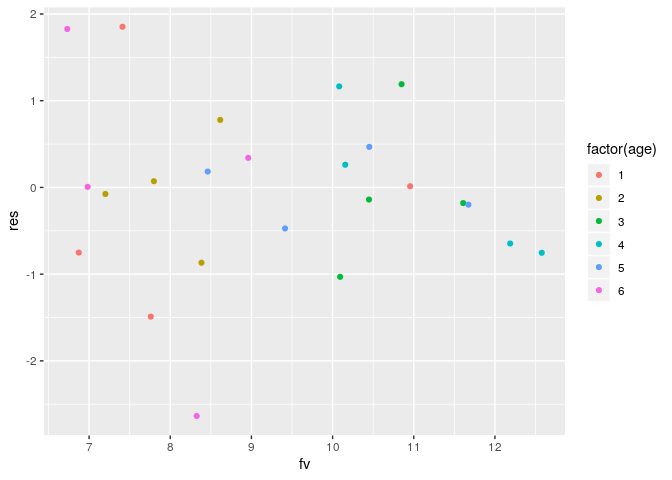
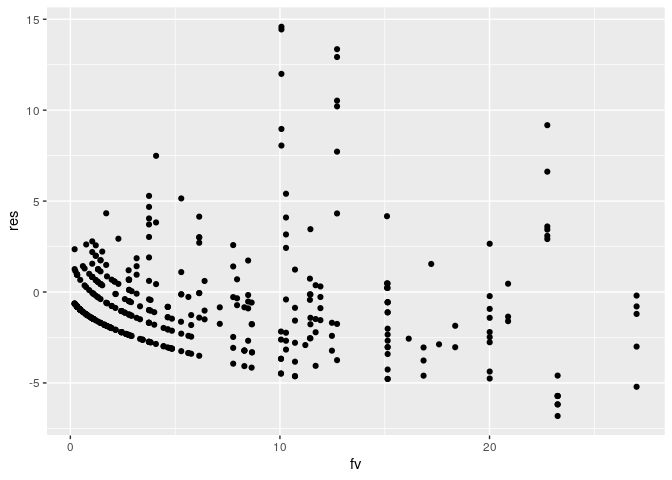

Answers to exercizes “count data: poison models”
================

# Exercise 1

## 1a

``` r
p1 <- read.table("cancer",header=TRUE)
cancer.fit <- glm(cases~factor(age)+factor(city)+
                    offset(log(pop/1000)),family=poisson,data=p1)
```

## 1b

``` r
p1 <- data.frame(p1,res=resid(cancer.fit),fv=fitted(cancer.fit))
library(ggplot2)
ggplot(p1,aes(x=fv,y=res))+geom_point(aes(color=factor(age)))
```

<!-- -->

## 1c

``` r
drop1(cancer.fit)
```

    ## Single term deletions
    ## 
    ## Model:
    ## cases ~ factor(age) + factor(city) + offset(log(pop/1000))
    ##              Df Deviance    AIC
    ## <none>            23.447 137.84
    ## factor(age)   5  126.515 230.90
    ## factor(city)  3   28.307 136.69

City can be left out:

``` r
cancer.fit2 <- glm(cases~factor(age)+offset(log(pop/1000)),
                   family=poisson,data=p1)
drop1(cancer.fit2)
```

    ## Single term deletions
    ## 
    ## Model:
    ## cases ~ factor(age) + offset(log(pop/1000))
    ##             Df Deviance    AIC
    ## <none>           28.307 136.69
    ## factor(age)  5  129.908 228.30

Age is needed in the model.

## 1d

``` r
summary(cancer.fit2)
```

    ## 
    ## Call:
    ## glm(formula = cases ~ factor(age) + offset(log(pop/1000)), family = poisson, 
    ##     data = p1)
    ## 
    ## Deviance Residuals: 
    ##     Min       1Q   Median       3Q      Max  
    ## -2.8520  -0.6424  -0.1067   0.7853   1.5468  
    ## 
    ## Coefficients:
    ##              Estimate Std. Error z value Pr(>|z|)    
    ## (Intercept)    1.0455     0.1741   6.006 1.90e-09 ***
    ## factor(age)2   1.0823     0.2481   4.363 1.29e-05 ***
    ## factor(age)3   1.5017     0.2314   6.489 8.66e-11 ***
    ## factor(age)4   1.7503     0.2292   7.637 2.22e-14 ***
    ## factor(age)5   1.8472     0.2352   7.855 4.00e-15 ***
    ## factor(age)6   1.4083     0.2501   5.630 1.80e-08 ***
    ## ---
    ## Signif. codes:  0 '***' 0.001 '**' 0.01 '*' 0.05 '.' 0.1 ' ' 1
    ## 
    ## (Dispersion parameter for poisson family taken to be 1)
    ## 
    ##     Null deviance: 129.908  on 23  degrees of freedom
    ## Residual deviance:  28.307  on 18  degrees of freedom
    ## AIC: 136.69
    ## 
    ## Number of Fisher Scoring iterations: 5

``` r
confint(cancer.fit2)
```

    ## Waiting for profiling to be done...

    ##                  2.5 %   97.5 %
    ## (Intercept)  0.6837463 1.368330
    ## factor(age)2 0.5930558 1.570406
    ## factor(age)3 1.0506603 1.961774
    ## factor(age)4 1.3043879 2.206600
    ## factor(age)5 1.3876652 2.313616
    ## factor(age)6 0.9143186 1.899720

For example: the log ratio mean number of cancer cases per 1000
individualsfor age 5 vs age 1 is 1.8472 with a 95% profile
log-likelihood confidence interval of (1.39;2.31)

For the ratio’s:

``` r
exp(coef(cancer.fit2))
```

    ##  (Intercept) factor(age)2 factor(age)3 factor(age)4 factor(age)5 factor(age)6 
    ##     2.844828     2.951584     4.489204     5.756252     6.342177     4.088919

``` r
exp(confint(cancer.fit2))
```

    ## Waiting for profiling to be done...

    ##                 2.5 %    97.5 %
    ## (Intercept)  1.981286  3.928784
    ## factor(age)2 1.809509  4.808601
    ## factor(age)3 2.859539  7.111934
    ## factor(age)4 3.685433  9.084775
    ## factor(age)5 4.005487 10.110915
    ## factor(age)6 2.495075  6.684026

The mean number of cancer cases per 1000 individuals in agegroup 5 is
6.34 largers as compared to age group1.

# Exrcise 2

## 2a

``` r
p2 <- read.table("coronary",header=TRUE)
```

## 2b

``` r
coro.fit <- glm(deaths~factor(Age)+factor(Smoke)+factor(Age):factor(Smoke)+offset(log(Pyears)),family=poisson,data=p2)
summary(coro.fit)
```

    ## 
    ## Call:
    ## glm(formula = deaths ~ factor(Age) + factor(Smoke) + factor(Age):factor(Smoke) + 
    ##     offset(log(Pyears)), family = poisson, data = p2)
    ## 
    ## Deviance Residuals: 
    ##  [1]  0  0  0  0  0  0  0  0  0  0
    ## 
    ## Coefficients:
    ##                             Estimate Std. Error z value Pr(>|z|)    
    ## (Intercept)                  -9.1479     0.7071 -12.937  < 2e-16 ***
    ## factor(Age)2                  2.3574     0.7638   3.087  0.00203 ** 
    ## factor(Age)3                  3.8302     0.7319   5.233 1.67e-07 ***
    ## factor(Age)4                  4.6227     0.7319   6.316 2.69e-10 ***
    ## factor(Age)5                  5.2944     0.7296   7.257 3.96e-13 ***
    ## factor(Smoke)1                1.7469     0.7289   2.397  0.01654 *  
    ## factor(Age)2:factor(Smoke)1  -0.9866     0.7901  -1.249  0.21174    
    ## factor(Age)3:factor(Smoke)1  -1.3628     0.7562  -1.802  0.07151 .  
    ## factor(Age)4:factor(Smoke)1  -1.4423     0.7565  -1.906  0.05659 .  
    ## factor(Age)5:factor(Smoke)1  -1.8470     0.7572  -2.439  0.01471 *  
    ## ---
    ## Signif. codes:  0 '***' 0.001 '**' 0.01 '*' 0.05 '.' 0.1 ' ' 1
    ## 
    ## (Dispersion parameter for poisson family taken to be 1)
    ## 
    ##     Null deviance:  9.3507e+02  on 9  degrees of freedom
    ## Residual deviance: -3.7303e-14  on 0  degrees of freedom
    ## AIC: 75.068
    ## 
    ## Number of Fisher Scoring iterations: 3

``` r
drop1(coro.fit,test = "Chisq")
```

    ## Single term deletions
    ## 
    ## Model:
    ## deaths ~ factor(Age) + factor(Smoke) + factor(Age):factor(Smoke) + 
    ##     offset(log(Pyears))
    ##                           Df Deviance    AIC    LRT Pr(>Chi)  
    ## <none>                          0.000 75.068                  
    ## factor(Age):factor(Smoke)  4   12.132 79.200 12.132  0.01639 *
    ## ---
    ## Signif. codes:  0 '***' 0.001 '**' 0.01 '*' 0.05 '.' 0.1 ' ' 1

## 2c

Fit the nested version:

``` r
coro.fit2 <- glm(deaths~factor(Age)+factor(Age):factor(Smoke)+offset(log(Pyears)),family=poisson,data=p2)
summary(coro.fit2)
```

    ## 
    ## Call:
    ## glm(formula = deaths ~ factor(Age) + factor(Age):factor(Smoke) + 
    ##     offset(log(Pyears)), family = poisson, data = p2)
    ## 
    ## Deviance Residuals: 
    ##  [1]  0  0  0  0  0  0  0  0  0  0
    ## 
    ## Coefficients:
    ##                             Estimate Std. Error z value Pr(>|z|)    
    ## (Intercept)                  -9.1479     0.7071 -12.937  < 2e-16 ***
    ## factor(Age)2                  2.3574     0.7638   3.087  0.00203 ** 
    ## factor(Age)3                  3.8302     0.7319   5.233 1.67e-07 ***
    ## factor(Age)4                  4.6227     0.7319   6.316 2.69e-10 ***
    ## factor(Age)5                  5.2944     0.7296   7.257 3.96e-13 ***
    ## factor(Age)1:factor(Smoke)1   1.7469     0.7289   2.397  0.01654 *  
    ## factor(Age)2:factor(Smoke)1   0.7603     0.3049   2.494  0.01264 *  
    ## factor(Age)3:factor(Smoke)1   0.3841     0.2014   1.907  0.05654 .  
    ## factor(Age)4:factor(Smoke)1   0.3046     0.2027   1.503  0.13295    
    ## factor(Age)5:factor(Smoke)1  -0.1001     0.2051  -0.488  0.62543    
    ## ---
    ## Signif. codes:  0 '***' 0.001 '**' 0.01 '*' 0.05 '.' 0.1 ' ' 1
    ## 
    ## (Dispersion parameter for poisson family taken to be 1)
    ## 
    ##     Null deviance:  9.3507e+02  on 9  degrees of freedom
    ## Residual deviance: -5.8620e-14  on 0  degrees of freedom
    ## AIC: 75.068
    ## 
    ## Number of Fisher Scoring iterations: 3

So this data shows a smoke effect in age 1 and age 2. the mean number of
deaths for smoke 1 is exp(1.7469)=5.74 time lager as compared to
not-smoke for agegroup 1 and exp(0.7603)=2.14 for agegroup 2.

## 2d

``` r
pyear.fit <- glm(log(Pyears)~factor(Age)+factor(Smoke),data=p2)
drop1(pyear.fit,test="F")
```

    ## Single term deletions
    ## 
    ## Model:
    ## log(Pyears) ~ factor(Age) + factor(Smoke)
    ##               Df Deviance    AIC F value    Pr(>F)    
    ## <none>             0.1155 -2.230                      
    ## factor(Age)    4   7.8670 31.980  67.101 0.0006405 ***
    ## factor(Smoke)  1   4.8995 33.244 165.649 0.0002101 ***
    ## ---
    ## Signif. codes:  0 '***' 0.001 '**' 0.01 '*' 0.05 '.' 0.1 ' ' 1

``` r
summary(pyear.fit)
```

    ## 
    ## Call:
    ## glm(formula = log(Pyears) ~ factor(Age) + factor(Smoke), data = p2)
    ## 
    ## Deviance Residuals: 
    ##         1          2          3          4          5          6          7  
    ## -0.178804   0.178804   0.007955  -0.007955   0.114142  -0.114142   0.102818  
    ##         8          9         10  
    ## -0.102818  -0.046110   0.046110  
    ## 
    ## Coefficients:
    ##                Estimate Std. Error t value Pr(>|t|)    
    ## (Intercept)      9.6623     0.1316  73.401 2.06e-07 ***
    ## factor(Age)2    -0.3788     0.1699  -2.229 0.089682 .  
    ## factor(Age)3    -0.8982     0.1699  -5.285 0.006149 ** 
    ## factor(Age)4    -1.7020     0.1699 -10.015 0.000559 ***
    ## factor(Age)5    -2.4208     0.1699 -14.245 0.000141 ***
    ## factor(Smoke)1   1.3833     0.1075  12.870 0.000210 ***
    ## ---
    ## Signif. codes:  0 '***' 0.001 '**' 0.01 '*' 0.05 '.' 0.1 ' ' 1
    ## 
    ## (Dispersion parameter for gaussian family taken to be 0.02888006)
    ## 
    ##     Null deviance: 12.65098  on 9  degrees of freedom
    ## Residual deviance:  0.11552  on 4  degrees of freedom
    ## AIC: -2.2302
    ## 
    ## Number of Fisher Scoring iterations: 2

There seems to be some logic in these effects.

# Exercise 3

## 3a

``` r
tick.fit <- glm(TICKS~HEIGHT+YEAR,family=poisson,
                data=lme4::grouseticks)
summary(tick.fit)
```

    ## 
    ## Call:
    ## glm(formula = TICKS ~ HEIGHT + YEAR, family = poisson, data = lme4::grouseticks)
    ## 
    ## Deviance Residuals: 
    ##     Min       1Q   Median       3Q      Max  
    ## -6.8191  -2.1524  -0.9718   0.4399  14.5859  
    ## 
    ## Coefficients:
    ##               Estimate Std. Error z value Pr(>|z|)    
    ## (Intercept) 11.5319124  0.3174212  36.330   <2e-16 ***
    ## HEIGHT      -0.0214518  0.0007104 -30.197   <2e-16 ***
    ## YEAR96       0.4096458  0.0453478   9.033   <2e-16 ***
    ## YEAR97      -1.6851410  0.0898007 -18.765   <2e-16 ***
    ## ---
    ## Signif. codes:  0 '***' 0.001 '**' 0.01 '*' 0.05 '.' 0.1 ' ' 1
    ## 
    ## (Dispersion parameter for poisson family taken to be 1)
    ## 
    ##     Null deviance: 5847.5  on 402  degrees of freedom
    ## Residual deviance: 3443.8  on 399  degrees of freedom
    ## AIC: 4382.8
    ## 
    ## Number of Fisher Scoring iterations: 6

## 3b

``` r
 exp(coef(tick.fit))
```

    ##  (Intercept)       HEIGHT       YEAR96       YEAR97 
    ## 1.019168e+05 9.787766e-01 1.506284e+00 1.854183e-01

So in 96 the mean number of ticks is 1.51 times larger as in 95 and .185
time lager, so 1/.185 times 5.39 times smaller, in 97 as compared to 95.

## 3c

``` r
p3 <- data.frame(lme4::grouseticks,res=resid(tick.fit),fv=fitted(tick.fit))
library(ggplot2)
ggplot(p3,aes(x=fv,y=res))+geom_point()
```

<!-- -->

There are some fitted values with very large residuals\! So the model
fitting is not done yet. See dependent data.

# Exercise 4

``` r
p4 <- read.table("BeetleEggCrowding.txt",header = TRUE)
negg.fit <- glm(NumEggs~factor(Temp)+factor(TRT)+
                  factor(Temp):factor(TRT),
                family = poisson,data=p4)
drop1(negg.fit)
```

    ## Single term deletions
    ## 
    ## Model:
    ## NumEggs ~ factor(Temp) + factor(TRT) + factor(Temp):factor(TRT)
    ##                          Df Deviance    AIC
    ## <none>                        485.57 673.43
    ## factor(Temp):factor(TRT)  1   494.02 679.88

Nested version:

``` r
negg.fit2 <- glm(NumEggs~factor(Temp)+
                  factor(Temp):factor(TRT),
                family = poisson,data=p4)
confint(negg.fit2)
```

    ## Waiting for profiling to be done...

    ##                                  2.5 %     97.5 %
    ## (Intercept)                  0.4439619  1.3733831
    ## factor(Temp)24               0.5238129  1.6054608
    ## factor(Temp)21:factor(TRT)I -0.1462810  0.8484397
    ## factor(Temp)24:factor(TRT)I -0.8269001 -0.1911217

So there is a temperature effect at 24 degrees. The log ratio of the
mean numer of eggs for trt I vs trt G is -0.5174 with a 95 % profile
log-likelihood confidence interval of (-0.827 -0.191).
